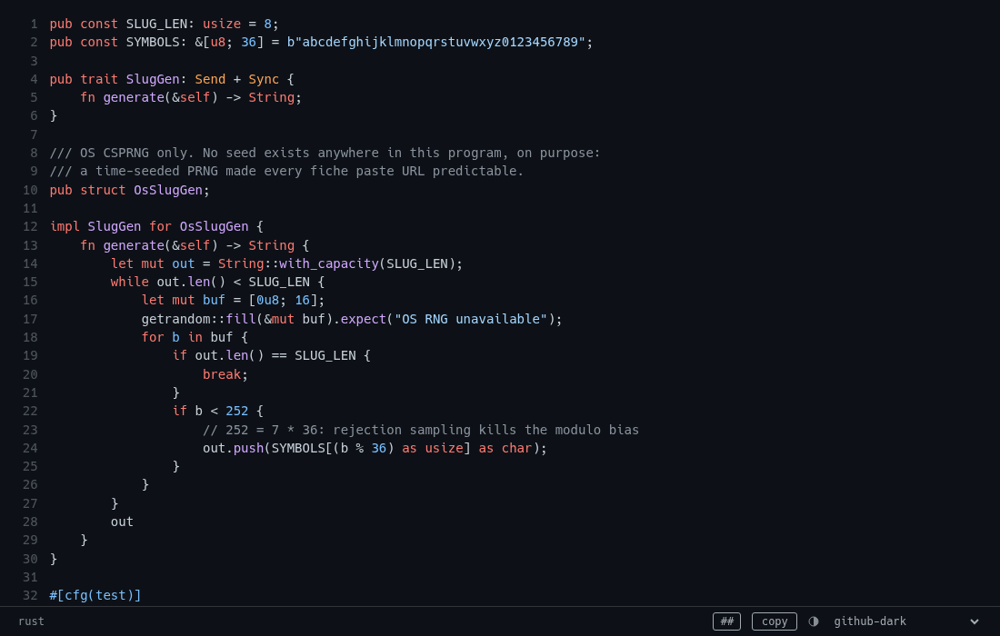

<p align="center">
  <picture>
    <source media="(prefers-color-scheme: dark)" srcset="docs/img/logo-dark.png">
    
  </picture>
</p>

<p align="center">
  <a href="https://github.com/AcidDemon/scrip/actions/workflows/ci.yml"></a>
  <a href="LICENSE"></a>
  
  
  
</p>

<p align="center">
  
</p>

Pipe anything into a TCP port, get a link back, open the link in a browser and
read it with syntax highlighting. scrip is a self-hosted pastebin you drive
from the shell. One static binary, one SQLite file, one config file.

It replaces [fiche](https://github.com/solusipse/fiche), which generated
guessable slugs from a time-seeded PRNG and put no bound on concurrent
connections. scrip draws slugs from the OS CSPRNG and caps connections, paste
size, and total storage.

## Try it

```sh
cargo build --release
./target/release/scrip run
```

With no config file, scrip takes pastes on `:9999`, serves HTTP on
`127.0.0.1:8080`, and hands out `http://localhost:8080/<slug>` links.

```sh
echo hello | nc -N localhost 9999
```

## Paste

```sh
cat main.rs        | nc -N paste.example.com 9999
git log --oneline  | nc -N paste.example.com 9999
journalctl -n 200  | nc -N paste.example.com 9999
```

Netcat has to close its write side when stdin runs out, or scrip waits for its
5 second idle timeout before answering. OpenBSD netcat wants `-N`, GNU netcat
wants `-q1`, busybox already does it. Worth an alias:

```sh
scrip() { nc -N paste.example.com 9999; }
```

There is no netcat on the box, or the network only lets HTTPS out:

```sh
curl --data-binary @main.rs https://paste.example.com/
```

Both write paths return the same thing, a URL on stdout.

The TCP port refuses what port scanners send to identify a service: an HTTP,
RTSP or SIP request line ending in CRLF, a TLS ClientHello, a lone SSH version
line, and nmap's standard probes byte for byte. Those get a
`scrip: refused ... probe` line back and nothing is stored. A body of nothing
but whitespace is dropped without a reply. To paste one of these on purpose,
put any line in front of it, or upload it with curl as above.

## Read

`https://paste.example.com/<slug>` is the viewer. Language detection is
automatic, and the picker in the status bar overrides it, as does `?lang=rust`.
Logs are the exception: `?lang=log` covers journalctl, syslog and the usual
bracketed-level formats, but it never wins detection on its own, because a log
grammar matches a little of almost any text.
`https://paste.example.com/raw/<slug>` serves the exact bytes as `text/plain`,
which is what you want for `curl` and `wget`.

Click a line number to link to that line, shift-click a second to select a
range: the URL becomes `#L7-L9` and opens scrolled there. The bar also carries
soft wrap, line numbers, raw, download, copy, and seven themes. Keys: `y` copy,
`r` raw, `d` download, `w` wrap, `l` line numbers.

<p align="center">
  
</p>

Pastes expire after 30 days by default.

## Per-paste options

HTTP uploads accept options in the query string. TCP uploads use the defaults:
the protocol has no options, so text that looks like one is paste content like
the rest.

```sh
curl --data-binary @debug.log 'https://paste.example.com/?ttl=2h'
curl --data-binary @secret.txt 'https://paste.example.com/?burn=1'
```

`ttl` shortens a paste's life below the configured retention. It takes plain
seconds or an `s`, `m`, `h`, `d` suffix, clamped between one minute and
`retention_days`.

`burn=1` makes the paste self-destruct on its first raw read. The viewer page
warns instead of rendering, because rendering would consume the paste; so
would a chat client's link preview, which is why the warning page exists.
Share the viewer link, not the raw one: anything that touches `/raw/<slug>`
eats the paste, mail scanners included.

Every curl paste answers with an `X-Delete-Token` header, and presenting that
token deletes the paste:

```sh
curl -X DELETE -H "X-Delete-Token: <token>" https://paste.example.com/<slug>
```

The server stores only a hash of the token, which cannot authorize a delete.
TCP replies contain only the URL, so nc pastes cannot be deleted this way;
`scrip rm` still works.

## Encryption at rest

```toml
encrypt_at_rest = true
```

With this enabled, every new paste is encrypted with XChaCha20-Poly1305 under
a key derived from its URL. The URL grows to 26 characters. The database
stores a hash of the URL token as the row id and ciphertext as the body.
Decrypting those bodies from the SQLite file or a backup requires the links.
Existing plaintext pastes stay readable, and encrypted pastes stay readable
if you later disable encryption.

This protects stored paste bodies, not data on a compromised running server.
It is not end-to-end encryption: the server sees plaintext when a paste
arrives and derives the key from the URL on every read. Pastes stored before
encryption was enabled remain in plaintext. Size, timestamps, and author IP
also remain unencrypted on every row.

When encryption is enabled, scrip logs only paste sizes by default. An
explicit `log_pastes` setting overrides this; log entries can include the
stored id, but never the URL token. Disable request-path logging in your
reverse proxy: those paths contain the tokens needed to decrypt the pastes.
Anyone with both the database and those logs can recover their contents.

Takedowns keep working: `scrip rm` accepts either the URL token or the
stored id from the log line.

## Deploy

```toml
base_url    = "https://paste.example.com"
db_path     = "/var/lib/scrip/scrip.db"
listen_tcp  = ["[::]:9999", "0.0.0.0:9999"]
listen_http = ["127.0.0.1:8080"]
```

Put a reverse proxy in front for TLS and point `base_url` at it. scrip trusts
`X-Forwarded-For` only when the connection comes from loopback, so the proxy
has to be local. [`deploy/`](deploy/) has a hardened systemd unit and an
nftables ruleset.

For Podman or Docker, the root `Containerfile` builds a shell-free `scratch`
image. See [container deployment](deploy/README.md#running-in-a-container)
for build commands, persistent storage, and the required proxy setup.

## Configuration

Every key has a default, and command line flags win over the file. The file
lives at `/etc/scrip/scrip.toml` unless `--config` says otherwise.

| key | default | what it does |
| --- | --- | --- |
| `base_url` | `http://localhost:8080` | prefix for returned links |
| `listen_tcp` | `["[::]:9999", "0.0.0.0:9999"]` | raw paste listeners |
| `listen_http` | `["127.0.0.1:8080"]` | HTTP listeners, empty disables HTTP |
| `db_path` | `scrip.db` | SQLite file |
| `max_paste_bytes` | `524288` | size cap per paste |
| `quota_bytes` | `1073741824` | total store cap, evicts expired and half-aged pastes before refusing |
| `retention_days` | `30` | age at which a paste is deleted |
| `rate_per_minute` | `6.0` | pastes per minute per source |
| `rate_burst` | `5.0` | how many can arrive at once |
| `read_rate_per_min` | `120.0` | paste reads (view and raw) per minute per source |
| `read_burst` | `60.0` | how many reads can arrive at once |
| `max_conns` | `1024` | connection cap across both listeners |
| `max_conns_per_source` | `12` | concurrent connections from one source, across TCP and HTTP |
| `idle_timeout_secs` | `5` | silence that ends a read |
| `total_deadline_secs` | `30` | hard ceiling on one paste |
| `gc_interval_secs` | `3600` | how often expired pastes are swept |
| `ban_reload_secs` | `10` | how often the ban table is re-read |
| `autoban_threshold` | `20` | rate refusals inside the window that trigger an auto-ban |
| `autoban_window_secs` | `60` | window for counting those refusals |
| `autoban_minutes` | `30` | first-offense ban length, `0` disables auto-bans |
| `autoban_factor` | `2.0` | ban length multiplier per repeat offense |
| `autoban_max_minutes` | `1440` | ceiling the escalation stops at |
| `autoban_forget_days` | `7` | quiet days after which strikes reset, `0` keeps them forever |
| `max_pastes_per_source` | `100` | live pastes one /32 or /64 may hold, `0` removes the cap |
| `log_pastes` | `"url"`, `"off"` under encryption | success log detail: `"url"` stored id + size, `"full"` id + size + author IP, `"off"` size only |
| `encrypt_at_rest` | `false` | seal new pastes with a key derived from their URL |
| `contact_email` | unset | shown on the landing page for takedowns; unset hides the line |

Rate limits and connection caps key on the address for IPv4 and on the /64 for
IPv6, because a residential IPv6 customer holds 2^64 addresses. IPv6 sources
also share an aggregate budget per /48 at 8x the per-/64 limits, so a
routed /48 cannot multiply every cap 65,536-fold by rotating /64s.

A config value scrip cannot parse or validate is a startup error with a
nonzero exit, never a silent fallback to a default.

## Admin

```sh
scrip rm <slug or URL>                   # takedown
scrip gc                                 # sweep expired pastes now
scrip ban add 203.0.113.0/24 --purge     # ban, and delete their pastes
scrip ban add 2001:db8::/32 --for 30d
scrip ban add 198.51.100.7               # a bare address is its /32
scrip ban list                           # time left and strikes per ban
scrip ban rm 198.51.100.7                # lift it and reset its strikes
scrip ban export | nft -f -              # push the list into the kernel
```

Bans apply within `ban_reload_secs` without a restart. `--purge` deletes the
ban target's pastes in the same transaction as the ban. Both operations
succeed or roll back together.

A bare IPv6 address means its /64, the range auto-bans use. When `ban rm`
finds no exact match, it names any wider ban that covers the address and
leaves it alone.

Run these as root or as the database owner. Run as root, `ban add` and
`ban rm` also reload `scrip-firewall` so nftables follows. The NixOS module
puts `scrip` on the PATH and links the config to `/etc/scrip/scrip.toml`, so
no flags are needed there.

## Development

```sh
scripts/check.sh                                        # what CI runs: fmt, clippy, tests
scripts/check.sh --full                                 # plus cargo-deny and a fuzz smoke
cargo test --release --test load -- --ignored load_smoke
cd fuzz && cargo +nightly fuzz run fuzz-protocol
```

`scripts/check.sh` runs the CI checks locally. It fetches missing tools through
`nix-shell` and reports checks it cannot run as skipped. To run it before each
push:

```sh
git config core.hooksPath .githooks
```

This enables `.githooks/pre-push`; `git push --no-verify` skips it once.

The load harness reads its thresholds from
[`thresholds.toml`](thresholds.toml). Review changes to those thresholds
alongside performance results. [`docs/design.md`](docs/design.md) covers the
wire protocol and the reasoning behind the limits.

## License

MIT.
